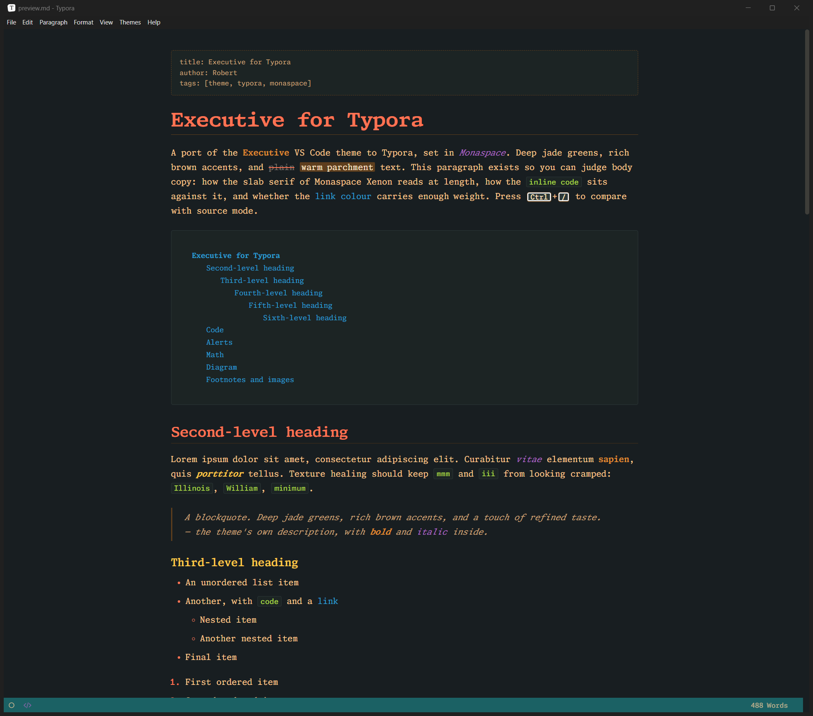

# Executive — a Typora theme

A port of the [Executive](https://github.com/rgehrsitz/executive-theme) VS Code
color theme to [Typora](https://typora.io), set in GitHub's
[Monaspace](https://github.com/githubnext/monaspace) type system.

Deep jade greens, rich brown accents, warm parchment text. Every colour in the
stylesheet is lifted from the VS Code theme's JSON, and each variable in
`executive.css` is annotated with the VS Code key it came from.



## Install

1. Grab the files: `git clone https://github.com/rgehrsitz/executive-typora-theme.git`,
   or download the repository as a zip from GitHub.
2. In Typora open **Preferences › Appearance › Open Theme Folder**.
3. Copy `executive.css` **and** the `executive/` folder into that folder.
4. Restart Typora and choose **Themes › Executive**.

Nothing else to install. The five Monaspace variable fonts (about 2.8 MB of
WOFF2) ship inside `executive/fonts/`, so the theme renders identically on
Windows, macOS and Linux with no system fonts required.

## Fonts

Monaspace is a superfamily of five metrics-compatible monospaced faces. The
theme defaults to:

| Role     | Family          | Why                                              |
|----------|-----------------|--------------------------------------------------|
| Prose    | Monaspace Xenon | Slab serif; the most "executive" voice of the five and the easiest to read at paragraph length |
| Headings | Monaspace Xenon | Heavier weight, slightly extended (`font-stretch: 112%`) for h1 and h2 |
| Code     | Monaspace Neon  | Neo-grotesque; the family GitHub recommends for editors, with all nine ligature sets on |

Texture healing (`calt`) and all nine coding-ligature sets (`ss01`–`ss09`)
are enabled in both prose and code, so `->`, `=>`, `!=` and friends render as
ligatures in body text too. If you would rather keep prose literal, trim
`--features-prose` in `executive.css` down to `"calt" 1, "liga" 1`.

To change a face, edit the three variables at the top of `:root` in
`executive.css`:

```css
--font-prose:   "Monaspace Xenon", ...;
--font-heading: "Monaspace Xenon", ...;
--font-code:    "Monaspace Neon",  ...;
```

Valid family names are `Monaspace Xenon`, `Monaspace Neon`, `Monaspace Argon`,
`Monaspace Krypton` and `Monaspace Radon`. If you only want one family, delete
the unused `.woff2` files and their `@font-face` blocks to shrink the theme.

## What maps to what

| Markdown element         | Colour    | Source scope in the VS Code theme          |
|--------------------------|-----------|--------------------------------------------|
| Body text                | `#fdc78e` | `editor.foreground`                        |
| Background               | `#181e21` | `editor.background`                        |
| h1, h2                   | `#ff7353` | `markup.heading`                           |
| h3, h4                   | `#ffc848` | `entity.name.type`                         |
| Heading `#` marks        | `#2b9ed1` | `markup.heading punctuation.definition`    |
| **Bold**                 | `#dd8730` | `markup.bold`                              |
| *Italic*                 | `#ab66c0` | `markup.italic`                            |
| `Inline code`            | `#acdb47` | `markup.inline.raw.markdown`               |
| Links                    | `#2b9ed1` | `string.other.link.title.markdown`         |
| List markers             | `#ff7353` | `punctuation.definition.list.markdown`     |
| Blockquote text          | `#c9a178` | see note below                             |
| Rules, borders           | `#5e3e1d` | `input.border`, indent guides              |
| Selection                | `#1b676b` | `selection.background`                     |
| Sidebar                  | `#242e2e` | `sideBar.background`                       |
| Footer (word count)      | `#1b6164` | `statusBar.background`                     |

Fenced code blocks use the theme's general syntax palette: keywords purple,
strings green, numbers orange, functions blue, variables coral, types teal,
comments brown italic. The mapping from CodeMirror token classes to VS Code
scopes is documented in a comment above section 7 of the stylesheet.

**One deliberate deviation.** VS Code renders `markup.quote.markdown` in the
comment colour `#996b3d`, which is fine for a line or two in an editor but
falls below comfortable contrast for paragraphs of quoted prose. Blockquotes
here use `#c9a178` (the theme's breadcrumb colour) with a `#5e3e1d` bar. Change
`blockquote { color: … }` in section 6 if you prefer strict fidelity.

## Customising

All colours are CSS custom properties on `:root`, prefixed `--exec-`. Change a
value once and it propagates everywhere it is used. Typora's own variables
(`--bg-color`, `--text-color`, `--md-char-color`, `--monospace`, and so on)
are set from those.

The Monaspace ligature sets are applied only to the document body, headings,
code and the sidebar. Typora draws its preferences panel, menus, dialogs and
mermaid diagrams in system fonts, and OpenType stylistic sets mean different
things in different fonts (Segoe UI and Trebuchet MS both turn some of them
into small caps or unicase), so those areas get only `calt` and `liga` via
`--features-safe`. Mermaid diagrams are additionally pointed at Monaspace
Argon through Typora's `--mermaid-font-family` variable.

Exports to PDF and HTML keep the dark canvas. Remove or edit the `@media print`
block at the end of the file if you want to export on white.

## Files

```
executive.css                 the theme
executive/
  fonts/
    MonaspaceXenonVar.woff2
    MonaspaceNeonVar.woff2
    MonaspaceArgonVar.woff2
    MonaspaceKryptonVar.woff2
    MonaspaceRadonVar.woff2
    LICENSE-Monaspace-OFL.txt
preview.md                    a document that exercises every styled element
docs/
  screenshot.png              preview.md captured in Typora on Windows
  screenshot.md               a compact alternative source document
```

## Licence

Theme CSS: MIT. Monaspace fonts: SIL Open Font License 1.1 (see
`executive/fonts/LICENSE-Monaspace-OFL.txt`). The Executive colour palette is
from the MIT-licensed VS Code theme by Kyle Alm and contributors.
