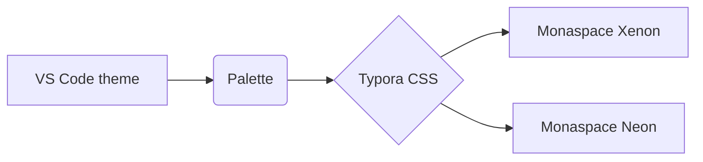

# Executive for Typora

A port of the **Executive** VS Code theme to Typora, set in *Monaspace*. Deep jade greens, rich brown accents, and ~~plain~~ ==warm parchment== text. This paragraph exists so you can judge body copy: how the slab serif of Monaspace Xenon reads at length, how the `inline code` sits against it, and whether the [link colour](https://github.com/rgehrsitz/executive-theme) carries enough weight. Press <kbd>Ctrl</kbd>+<kbd>/</kbd> to compare with source mode.

[TOC]

## Second-level heading

Lorem ipsum dolor sit amet, consectetur adipiscing elit. Curabitur *vitae* elementum **sapien**, quis ***porttitor*** tellus. Texture healing should keep `mmm` and `iii` from looking cramped: `Illinois`, `William`, `minimum`.

> A blockquote. Deep jade greens, rich brown accents, and a touch of refined taste.
> — the theme's own description, with **bold** and *italic* inside.

### Third-level heading

- An unordered list item
- Another, with `code` and a [link](https://typora.io)
  - Nested item
  - Another nested item
- Final item

1. First ordered item
2. Second ordered item
3. Third ordered item

- [x] A completed task
- [ ] A pending task
- [ ] Another pending task

#### Fourth-level heading

| Column        | Type     | Default   | Notes                        |
|---------------|----------|-----------|------------------------------|
| `--exec-bg`   | colour   | `#181e21` | editor.background            |
| `--exec-text` | colour   | `#fdc78e` | editor.foreground            |
| `--font-prose`| font     | Xenon     | swap for Argon, Neon, etc.   |
| Alignment     | text     | left      | zebra rows every second line |

##### Fifth-level heading

###### Sixth-level heading

---

## Code

```typescript
// Monaspace Neon with all stylistic sets: != === -> => <= >= :: |> </ />
import { readFile } from "node:fs/promises";

interface Theme {
  name: string;
  weights: number[];
  readonly dark: boolean;
}

export async function loadTheme(path: string): Promise<Theme> {
  const raw = await readFile(path, "utf8");
  const parsed = JSON.parse(raw) as Partial<Theme>;
  if (parsed.name === undefined || parsed.weights?.length !== 3) {
    throw new Error(`invalid theme: ${path}`);
  }
  return { dark: true, ...parsed } as Theme;
}

const total = [200, 400, 800].reduce((a, b) => a + b, 0) / 3; // 466.67
```

```python
from dataclasses import dataclass

@dataclass
class Palette:
    """Executive palette."""
    jade: str = "#1c6f73"
    brown: str = "#5e3e1d"

    def contrast(self, other: "Palette") -> float:
        return 4.5 if self.jade != other.jade else 1.0

for i in range(3):
    print(f"row {i}: {Palette().contrast(Palette())}")
```

```css
:root {
    --exec-coral: #ff7353;
    --exec-gold:  #ffc848;
}
h1, h2 { color: var(--exec-coral); font-stretch: 112%; }
```

```diff
- removed line
+ added line
  unchanged line
```

```bash
git clone --depth 1 https://github.com/rgehrsitz/executive-theme.git
ls -la ~/.config/Typora/themes && echo "done"   # comment
```

## Alerts

> [!NOTE]
> Useful information that users should know, even when skimming content.

> [!TIP]
> Helpful advice for doing things better or more easily.

> [!IMPORTANT]
> Key information users need to know to achieve their goal.

> [!WARNING]
> Urgent info that needs immediate user attention to avoid problems.

> [!CAUTION]
> Advises about risks or negative outcomes of certain actions.

## Math

Inline math $E = mc^2$ and a block:

$$
\int_{0}^{\infty} e^{-x^2}\,dx = \frac{\sqrt{\pi}}{2}
$$

## Diagram



## Footnotes and images

A sentence with a footnote.[^1] And an image:


[^1]: The footnote text, rendered at the bottom of the document.
